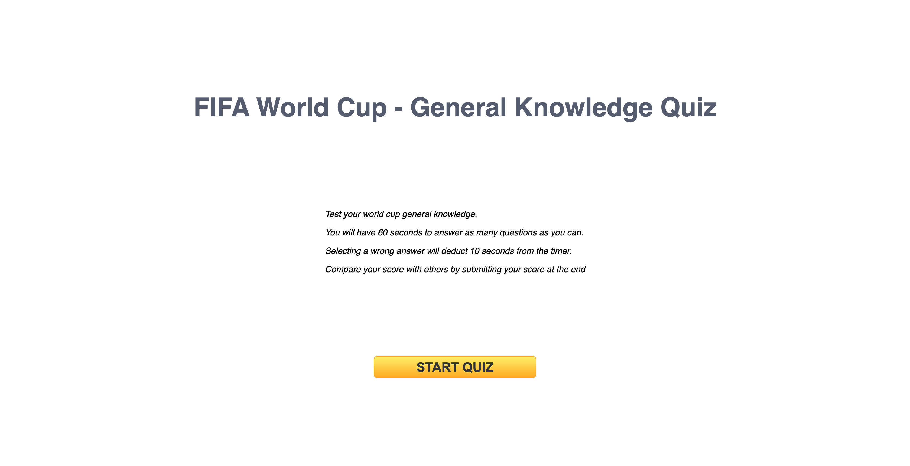
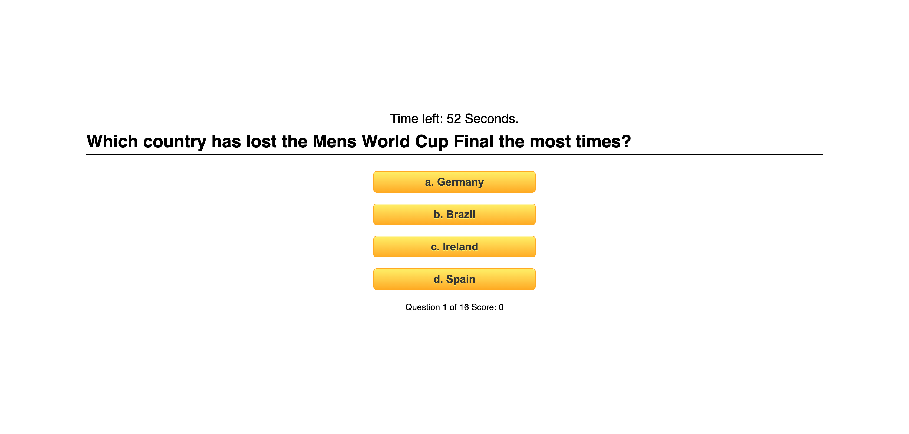
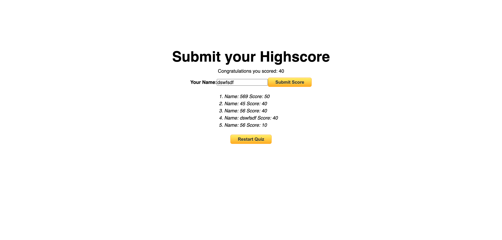

# World Cup Quiz

## 💡 Description
This project is a Quiz to test your knowledge on world cup history. Creating this project helped me understand the importance of Javascript and how it interacts with webpages. Overall I believe the skills need to create this program helped further my knowledge of Javascript. 

## ✔️ Rules

- Test your world cup general knowledge.
- You will have 60 seconds to answer as many questions as you can.
- Selecting a wrong answer will deduct 10 seconds from the timer.
- Compare your score with others by submitting your score at the end.

## 🔗 Links 

[Deployed Webpage](https://steven-mccombe.github.io/world-cup-quiz/)

## 📸 Screenshot 

## 📝 License

MIT license